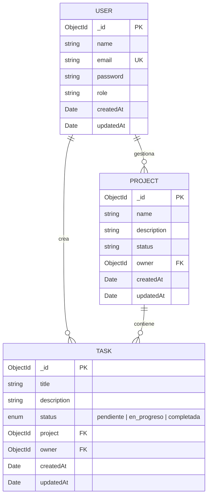

# ⚡ TaskFlow

<p align="center">
  
  
  
  
  
  
  
  
</p>

<p align="center">
  <strong>TaskFlow</strong> es una plataforma web Full-Stack moderna y escalable para la gestión de proyectos y flujos de trabajo en equipos ágiles. Desarrollada con arquitectura desacoplada y limpia utilizando <strong>NestJS</strong> en el backend, <strong>MongoDB</strong> como base de datos NoSQL y <strong>Angular 21</strong> (Standalone Components, Signals & Tailwind CSS) en el frontend.
</p>

---

## 📑 Tabla de Contenidos

- [✨ Características Destacadas](#-características-destacadas)
- [🐳 Puesta en Marcha Rápida con Docker (Recomendado)](#-puesta-en-marcha-rápida-con-docker-recomendado)
- [🌱 Datos de Prueba (Demo Seeder)](#-datos-de-prueba-demo-seeder)
- [🛠️ Arquitectura y Stack Tecnológico](#️-arquitectura-y-stack-tecnológico)
- [📂 Estructura del Proyecto](#-estructura-del-proyecto)
- [💻 Ejecución en Desarrollo Local (Sin Docker)](#-ejecución-en-desarrollo-local-sin-docker)
- [📡 Documentación Interactiva OpenAPI / Swagger](#-documentación-interactiva-openapi--swagger)
- [🗄️ Modelo de Datos (ER Diagram)](#️-modelo-de-datos-er-diagram)
- [🚀 Integración Continua (CI/CD)](#-integración-continua-cicd)
- [🗺️ Roadmap y Estado del Proyecto](#️-roadmap-y-estado-del-proyecto)
- [👤 Autor](#-autor)

---

## ✨ Características Destacadas

- 🎯 **Tablero Kanban con Native Drag & Drop**: Gestión visual e interactiva de tareas (*Por Hacer*, *En Progreso*, *Completadas*) con animaciones fluidas inspiradas en Framer Motion y física de resortes CSS.
- 🔐 **Autenticación JWT & Seguridad Robusta**: Registro e inicio de sesión con encriptación `bcryptjs`, protección de rutas con `AuthGuard` funcional y token auto-inyectado vía `HttpInterceptor`.
- 📁 **Gestión de Proyectos & Eliminación en Cascada**: CRUD completo con verificación estricta de propiedad (ownership) y limpieza automática de tareas asociadas al eliminar proyectos.
- 📊 **Dashboard y Métricas en Tiempo Real**: Tarjetas con contadores dinámicos, barras de progreso porcentual y acceso rápido a tableros.
- 🎨 **Diseño UI/UX Pro Max**: Glassmorphism premium, tipografía *Plus Jakarta Sans*, micro-interacciones de resorte (`springPop`), notificaciones toast reactivas y modo alternativo Kanban / Lista.
- 📖 **Swagger / OpenAPI**: Documentación viva e interactiva de todos los endpoints protegidos y schemas en `/api/docs`.
- 🐳 **Contenedorización Total**: Despliegue con un solo comando gracias a `docker-compose.yml` (MongoDB 7, API NestJS, Angular en Nginx y panel Mongo Express).

---

## 🐳 Puesta en Marcha Rápida con Docker (Recomendado)

> [!TIP]
> No necesitas instalar Node.js ni MongoDB en tu máquina. Con tener **Docker Desktop** instalado, puedes levantar todo el ecosistema con un solo comando.

### 1. Clonar el repositorio
```bash
git clone https://github.com/Juan2007-sys/Tasks-Flow.git
cd Tasks-Flow
```

### 2. Iniciar todos los contenedores
```bash
docker compose up --build -d
```

### 3. URLs de acceso a los servicios

| Servicio | URL | Descripción |
| :--- | :--- | :--- |
| **Frontend Web** | [http://localhost](http://localhost) | Aplicación Angular servida en Nginx Alpine |
| **Backend REST API** | [http://localhost:3000](http://localhost:3000) | Servidor NestJS con Node 20 Alpine |
| **Swagger UI** | [http://localhost:3000/api/docs](http://localhost:3000/api/docs) | Documentación interactiva de la API |
| **Mongo Express GUI** | [http://localhost:8081](http://localhost:8081) | Explorador visual de MongoDB |

---

## 🌱 Datos de Prueba (Demo Seeder)

Para explorar la aplicación de inmediato con proyectos, tareas en diferentes columnas Kanban y métricas reales:

### Opción A: Iniciar sesión con la cuenta Demo predefinida
Una vez ejecutado el seeder, puedes ingresar con:
- **Email:** `demo@taskflow.dev`
- **Contraseña:** `Password123!`

### Opción B: Ejecutar el Seeder manualmente
```bash
# Desde la carpeta backend/
cd backend
npm run seed
```

---

## 🛠️ Arquitectura y Stack Tecnológico

```
┌────────────────────────────────────────────────────────┐
│                   TaskFlow Architecture                │
└────────────────────────────────────────────────────────┘
                       │
       ┌───────────────┴───────────────┐
       ▼                               ▼
┌──────────────┐               ┌──────────────┐
│  Angular 21  │ (Port 80/4200)│  NestJS API  │ (Port 3000)
│  Nginx / SPA │◄─────────────►│  Express/JWT │
└──────────────┘    REST/JSON  └──────┬───────┘
                                      │ Mongoose
                                      ▼
                               ┌──────────────┐
                               │  MongoDB 7   │ (Port 27017)
                               │  Collections │
                               └──────────────┘
```

### **Backend**
- **Framework**: [NestJS 11](https://nestjs.com/) (Arquitectura modular basada en servicios, controladores y módulos)
- **Base de Datos**: [MongoDB 7](https://www.mongodb.com/) con [Mongoose ODM 9](https://mongoosejs.com/)
- **Seguridad**: Passport.js + JWT Strategy + `bcryptjs`
- **Validación & Transformación**: `class-validator` + `class-transformer` con `ValidationPipe` global
- **Documentación**: `@nestjs/swagger` + `swagger-ui-express`

### **Frontend**
- **Framework**: [Angular 21](https://angular.dev/) (Standalone Components, Signals, Reactive Forms)
- **Estilos & Animaciones**: Tailwind CSS v3/v4, Glassmorphism y CSS Spring Micro-interactions
- **Cliente HTTP**: Angular `provideHttpClient` con Interceptor funcional de autenticación
- **Drag & Drop**: Native HTML5 Drag and Drop API con soporte visual interactivo

---

## 📂 Estructura del Proyecto

```text
TaskFlow/
├── .github/
│   └── workflows/
│       └── ci.yml               # Pipeline de integración continua (GitHub Actions)
├── backend/                     # API REST (NestJS)
│   ├── src/
│   │   ├── auth/                # Módulo de Autenticación (Login, Register, JWT Guard)
│   │   ├── projects/            # Módulo de Proyectos (CRUD, Ownership & Cascade Delete)
│   │   ├── tasks/               # Módulo de Tareas (CRUD, Filtro por Proyecto, Estados)
│   │   ├── seed.ts              # Script de inserción de datos de demostración
│   │   ├── app.module.ts        # Módulo raíz de la aplicación
│   │   └── main.ts              # Bootstrap, Swagger, CORS y Pipes
│   ├── Dockerfile               # Multi-stage build (Node 20 Alpine)
│   └── package.json
│
├── frontend/                    # Cliente Web SPA (Angular 21)
│   ├── src/
│   │   ├── app/
│   │   │   ├── components/      # Navbar global, Toast Notifications, etc.
│   │   │   ├── guards/          # AuthGuard reactivo
│   │   │   ├── interceptors/    # Inyección de Bearer Token & manejo 401
│   │   │   ├── models/          # Interfaces TypeScript (User, Project, Task)
│   │   │   ├── pages/           # Vistas (Login, Register, Dashboard, Projects, Tasks)
│   │   │   ├── services/        # Servicios reactivos con Signals (Auth, Projects, Tasks, Toast)
│   │   │   ├── app.routes.ts    # Configuración de enrutamiento
│   │   │   └── app.config.ts    # Proveedores de la aplicación
│   │   └── styles.css           # Clases utilitarias, animaciones y tokens
│   ├── nginx.conf               # Configuración de Nginx con SPA fallback y Gzip
│   ├── Dockerfile               # Multi-stage build (Node Alpine -> Nginx Alpine)
│   └── package.json
│
├── docker-compose.yml           # Orquestación de MongoDB, Backend, Frontend y Mongo Express
└── README.md
```

---

## 💻 Ejecución en Desarrollo Local (Sin Docker)

Si prefieres ejecutar el proyecto localmente sin Docker:

### 1. Requisitos
- Node.js 20.x o superior
- MongoDB corriendo localmente en el puerto `27017`

### 2. Backend
```bash
cd backend
npm install
npm run seed       # (Opcional) Carga los datos de prueba
npm run start:dev  # Inicia en http://localhost:3000
```

### 3. Frontend
```bash
cd frontend
npm install
npm start          # Inicia en http://localhost:4200
```

---

## 📡 Documentación Interactiva OpenAPI / Swagger

Una vez iniciado el servidor backend, accede a la documentación interactiva en:

📍 **[http://localhost:3000/api/docs](http://localhost:3000/api/docs)**

Permite probar todos los endpoints en vivo, autorizar con token JWT y consultar los DTOs de entrada y salida.

### Endpoints Principales

| Módulo | Método | Endpoint | Descripción | Protegido |
| :--- | :--- | :--- | :--- | :---: |
| **Auth** | `POST` | `/auth/register` | Registro de nuevos usuarios | ❌ |
| **Auth** | `POST` | `/auth/login` | Inicio de sesión (Retorna JWT) | ❌ |
| **Projects** | `GET` | `/projects` | Listar proyectos del usuario | 🔒 |
| **Projects** | `POST` | `/projects` | Crear nuevo proyecto | 🔒 |
| **Projects** | `GET` | `/projects/:id` | Obtener detalle de proyecto | 🔒 |
| **Projects** | `PUT` | `/projects/:id` | Actualizar proyecto | 🔒 |
| **Projects** | `DELETE` | `/projects/:id` | Eliminar proyecto y sus tareas asociadas | 🔒 |
| **Tasks** | `GET` | `/tasks/proyecto/:id` | Listar tareas de un proyecto | 🔒 |
| **Tasks** | `POST` | `/tasks` | Crear nueva tarea | 🔒 |
| **Tasks** | `PUT` | `/tasks/:id` | Actualizar estado o datos de tarea | 🔒 |
| **Tasks** | `DELETE` | `/tasks/:id` | Eliminar tarea | 🔒 |

---

## 🗄️ Modelo de Datos (ER Diagram)



---

## 🚀 Integración Continua (CI/CD)

El proyecto cuenta con un workflow automatizado de **GitHub Actions** (`.github/workflows/ci.yml`) que se ejecuta en cada `push` y `pull request`:
- ✅ Instalación limpia de dependencias (`npm ci`).
- ✅ Verificación de tipos y compilación completa de NestJS.
- ✅ Verificación de tipos y compilación para producción de Angular 21.

---

## 🗺️ Roadmap y Estado del Proyecto

- [x] **Arquitectura Modular**: Separación de dominios en NestJS con DTOs tipados.
- [x] **Autenticación Segura**: JWT con hash bcrypt y guardias funcionales.
- [x] **Angular Signals**: Gestión reactiva de estado global de usuario y proyectos.
- [x] **Tablero Kanban con Drag & Drop**: Interacción fluida entre estados de tareas.
- [x] **Diseño UI/UX Pro Max**: Glassmorphism, animaciones spring y Tailwind CSS.
- [x] **OpenAPI / Swagger**: Documentación viva en `/api/docs`.
- [x] **Eliminación en Cascada**: Borrado de tareas dependientes al eliminar proyectos.
- [x] **Sistema de Notificaciones Toast**: Feedback visual para todas las acciones del usuario.
- [x] **Contenedores Docker & Docker Compose**: Despliegue listo para producción.
- [x] **Database Seeder**: Datos demo listos para reclutadores (`npm run seed`).
- [x] **CI/CD Pipeline**: Validación automática en GitHub Actions.

---

## 👤 Autor

Desarrollado por **Juan Quevedo**.

- **GitHub**: [@Juan2007-sys](https://github.com/Juan2007-sys)
- **Repositorio**: [TaskFlow](https://github.com/Juan2007-sys/Tasks-Flow)

---

⭐ Si este proyecto te resulta interesante, ¡no olvides darle una estrella en GitHub!
